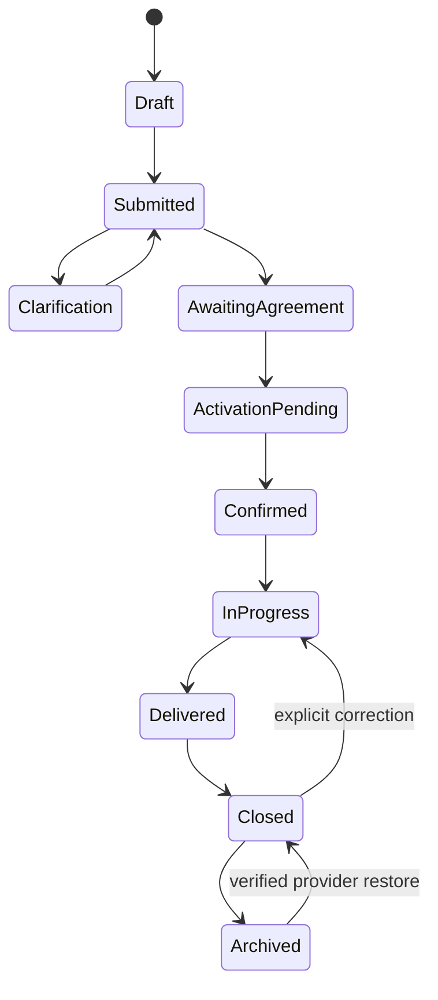

# StreamLion client onboarding and coordination development specification

Version 0.1 — October 7, 2026 — development draft.

Implementation follow-through: the subsequently authorized, disabled pilot is documented in [client-coordination-activation.md](client-coordination-activation.md). That document records concrete modules, activation gates and narrower first-release limits, including retained Google history and deferred destructive compaction.

Build a free client-facing web experience connected to the provider's StreamLion job workflow. A provider shares a job-specific link; the client supplies and updates the brief, agrees to the scope, and follows progress. The provider receives organized, queryable instructions and explicit acknowledgment of important changes. After closure, preserve the complete record in the provider's Google Drive and retire active client access on a stated schedule.

This specification authorizes planning, not production activation. It introduces no working client portal, migration, credentials, messages, credit grants, payment, AI request, or archival operation. Baseline inspected: repository main at 62ced07485ffca129874eac9a7be28ed74c31c5f. Recheck the implementation baseline before development.

## 1. Product decisions and commercial defaults

| Subject          | Specification                                                                                                                                                                                                    |
| ---------------- | ---------------------------------------------------------------------------------------------------------------------------------------------------------------------------------------------------------------- |
| Client interface | StreamLion's own responsive web interface. Jotform 262396366448167 is a reference for questions and flow only; no Jotform runtime, account, connector, or submission dependency.                                 |
| Primary audience | Independent spatial-capture providers and their direct clients, including one-time clients. Agency dispatch and organization roles are a later increment.                                                        |
| Ownership        | Google Sheets/Drive remain authoritative for project information, agreements, evidence, and archives. Cloudflare holds authorization, operational metadata, recoverable operations, and credit accounting.       |
| Core purchase    | Preserve the documented $39.95 one-time Core offer and existing launch offer. Included app improvements remain distinct from optional hosted coordination usage.                                                 |
| Client price     | Free. The provider pays for coordination; the client never needs a credit wallet or model subscription.                                                                                                          |
| Project charge   | Pilot default: 240 existing credits, equivalent to $3, once per activated work order. A $2 alternative is 160 credits. No percentage commission or fee per edit, visit, acknowledgment, or status check.         |
| Starter grant    | 600 non-expiring promotional credits once per eligible purchased provider account, usable for provider AI assistance or coordination. Existing experimental AI-pilot grants remain separate.                     |
| Included service | Ordinary intake, clarification, approval, revisions, status, handover, closure, and 90 days of read-only client access after closure. AI answers continue to use their separately quoted credit charge.          |
| Archival         | At closure plus 90 days, end client portal access and complete a verified provider-owned archive, unless a provider-approved extension or unresolved-work hold applies. Reminder at 14 days before the deadline. |

Amounts are the development defaults carried forward from the discussion, not live catalog changes. Final commercial terms, cancellation treatment, and activation need owner approval. Credit purchasing value is not the company's cost to serve a project.

## 2. Problem, value, and pilot outcome

The critical problem is arriving with incomplete, outdated, conflicting, or unacknowledged instructions. A second problem is time spent calling, emailing, and searching for scope, access, dates, delivery requirements, or status.

The product must make five facts immediately answerable: what was agreed; what remains unknown; who must act; what changed since the last review; and which information is current and acknowledged. AI helps explain and query this record, but never supplies missing facts or acts as evidence that an agreement, payment, or delivery occurred.

Hypotheses to validate: less administrative time, fewer material omissions at arrival, faster clarification, fewer unnecessary status messages, and repeat use worth the proposed charge. No measured savings, market demand, or margin is established by this spec.

Pilot: synthetic acceptance first, then an explicitly authorized small field pilot of approximately five providers and twenty jobs. Record provider-reported before/after coordination time, clarification exchanges, missing information at arrival, important-change acknowledgment, client completion and abandonment, second-job use, top-ups, support minutes, and full lifecycle cost. Avoid logging briefs, access codes, email addresses, or attachment contents for analytics.

Suggested evaluation targets, to ratify before the field pilot: at least 80% of invited clients complete intake without assistance; at least 70% of participating providers want to use it again; a median reduction of at least ten administrative minutes per job; and full variable cost no higher than $0.90 per $3 project. These are hypotheses, not release guarantees or public claims. Paid-service cost must include abandoned enquiries and free-credit usage as well as completed jobs.

## 3. Scope and user journeys

### Provider

1. Enable client coordination for one explicitly selected Google workbook and app-managed Drive folder. Review what the app may do while the provider is away.
2. Create a named request, select approved service defaults, enter the intended client's email, and copy or explicitly send the invitation.
3. See client submissions, attachments, missing information, and source-linked changes in a Requests view. Ask targeted questions and propose the final scope, fee, and schedule.
4. Approve the same version the client accepts and authorize the quoted coordination charge. Activation is complete only after verified records and credit accounting agree.
5. Open the ordinary Prepare → On site → Before leaving → Delivery workflow with the accepted brief. Prominent alerts show material changes requiring review.
6. Record work and delivery; receive authenticated client acknowledgment. Close the work order with a visible archive/access deadline.
7. Retrieve archived jobs by reference, date, and site. Reopen a correction explicitly without charging again for the same work order.

### Client

1. Open a job invitation on a phone or desktop. Verify the invited email; no application install or full profile creation.
2. Complete a short guided brief with autosave and explicit saved/pending/error states. Supply unknowns honestly rather than guessing.
3. Answer targeted questions and accept or request changes to a clearly presented scope, fee, deliverables, dates, and hosting/handoff terms.
4. Return to a job summary showing accepted details, outstanding questions, changes, relevant progress, delivery, and sourced payment information.
5. Propose changes during the job, acknowledge delivery, and download the client handover before portal access expires.

MVP: one provider, one verified commissioning client, one work order with one primary site and potentially multiple rooms and visits. Onsite contacts are information fields, not automatically authorized portal users. For a property series, reuse approved client details across linked requests and disclose any separate job charges before activation; do not silently split one brief into billed projects. A repeatable multi-location intake and group confirmation are the next increment.

Exclude from MVP: agency assignment, multi-provider organizations, public reusable booking links, automatic scheduling availability, scan-platform APIs, invoice generation or bank reconciliation, raw scan hosting, unrestricted document formats, and client-triggered AI spending. Provider branding and settings are supported; TM's rates, deposits, 14-day temporary-hosting policy, upsells, and response promises are not universal defaults.

## 4. Screens and information contract

| Screen                  | Required content                                                                                                                                                        |
| ----------------------- | ----------------------------------------------------------------------------------------------------------------------------------------------------------------------- |
| Provider settings       | Branding, supported services, versioned intake defaults, required fields, notification preferences, permitted client-visible fields, and coordination/retention policy. |
| Client first visit      | Provider identity, project purpose, privacy/access notice, email verification, and concise guided intake.                                                               |
| Client job home         | Accepted scope, confirmed arrangements, pending questions, change summary, status source and timestamp, attachments, and handover.                                      |
| Provider review         | Original client wording, field-by-field differences, unresolved information, accept/reject/request-clarification actions, and confirmation quote.                       |
| Provider field workflow | Accepted brief and its version, changed-instruction alerts, existing checklist and evidence, and before-leaving review.                                                 |
| Archive view            | Closed-job index, archive completeness, access deadline, restore/download actions, and archive failures.                                                                |

Reuse [field-map.md](field-map.md) and [project-schema.js](../src/project-schema.js) for existing project fields. Add versioned coordination data rather than renaming existing Projects or Observations headers.

Required groups: requesting party and onsite contacts; property/site and approximate size; capture purpose and service; required areas and exclusions; deliverables and deadline; tentative versus confirmed dates with timezone; access and preparation; reference documents; hosting/account handoff; requested and agreed fee and payment terms.

Dynamic questions depend on the selected service, property characteristics, and prior answers. Provider templates carry a version pinned to the request. Changing a template affects new requests unless an existing job explicitly accepts a revision. Distinguish mandatory information from helpful information. Allow Not known yet, with an assigned question when it prevents confirmation or field readiness.

Initially allow PDF, JPEG, and PNG attachments, at most 5 MB per file and ten files per job; measure the current upload path before approving these pilot limits. Keep originals private in app-managed Drive storage. Do not treat a URL as proof that an attachment exists or is accessible. No raw Matterport capture files, HTML, SVG, executable files, or unrestricted remote fetching.

Mobile: guided initial intake, then a compact job home with direct access to sections. Preserve drafts across navigation and interruption. Support accessible labels, keyboard and screen-reader use, phone dictation, readable error messages, and locale-aware dates/currency. Autosave must not label device-only or unverified server writes as saved.

## 5. Lifecycle, responsibilities, and change rules

The business lifecycle is independent of technical synchronization and payment state.

Cancellation is available before closure and retains the record. Delivery is not acceptance; acceptance is not a payment receipt; capture completion is not closure. The provider may close after client acknowledgment or a disclosed provider-managed closure process with reason and notice. Unresolved corrections, disputes, or an unreviewed payment issue prevent silent automatic closure. A cancelled activated job follows the same post-closure retention policy.

| Information/action                          | Client                                                                     | Provider                                                                           |
| ------------------------------------------- | -------------------------------------------------------------------------- | ---------------------------------------------------------------------------------- |
| Unconfirmed intake                          | Edit own brief and submit revisions                                        | Review, clarify, propose changes                                                   |
| Agreed scope, fee, date, deliverables       | Propose a new version; accept the exact offer version                      | Propose/approve a new version; accepted version stays active meanwhile             |
| Access/contact updates                      | Submit an update with change attribution                                   | Acknowledge important operational changes; stale information stays visibly flagged |
| Work progress and delivery                  | View; acknowledge receipt or report an issue                               | Publish client-visible progress and delivery                                       |
| Payment status                              | View source-labelled information; may submit a claim or receipt for review | Record supported information; never infer settlement from the offered fee          |
| Closure, extensions, reopening              | Request action                                                             | Authorize with reason and audit event                                              |
| Wallet, private field notes, internal costs | No access                                                                  | Provider only                                                                      |

Before agreement, revisions can freely replace the current request draft. After agreement, material edits create proposals with expected base version, exact changes, author, timestamp, and reason. Both parties agree to the same new material version before it becomes accepted. Do not mix a new fee with approval of an old scope.

Nonmaterial administrative updates can become current after verified save, but safety-sensitive changes such as access hours, entry method, or onsite contact require a prominent provider acknowledgment. A deterministic Ready for capture view lists missing required information, pending material proposals, unacknowledged important updates, and unsaved/unverified records. It is a workflow readiness aid, not certification of physical access or scan quality.

Authenticated acknowledgment records the verified actor, action, version/hash, and time. Do not advertise a certified electronic signature or independently verified payment unless those capabilities are separately implemented.

## 6. Architecture and authoritative records

| Existing component                  | Reuse                                                     | Necessary extension                                                                                                        |
| ----------------------------------- | --------------------------------------------------------- | -------------------------------------------------------------------------------------------------------------------------- |
| React/Vite PWA and Cloudflare Pages | Provider UI, shared schemas, checklist, handover          | Client route, requests/review UI, archive UI, separate client session                                                      |
| Google Sheets/Drive                 | Provider-owned projects, observations, private evidence   | Versioned coordination event tab and archive index; agreed-brief projection; verified archive format                       |
| Cloudflare Functions/D1             | Encrypted Google authorization, quotas, purchases, wallet | Job-scoped grants, provider connection binding, write coordinator, operations/recovery, notification and archive schedules |
| Stripe credit purchases             | Verified fulfillment, mode separation, refunds/disputes   | Shared-purpose spending and promotional-credit provenance; no new subscription                                             |
| Provider AI assistance              | Current explicit question/quote path                      | Authorized accepted-job context and clearly labelled pending changes; no automatic background model calls                  |

Proposed additive Google tabs are CoordinationEvents and ArchiveIndex, each with its own version marker and validated headers. Their final schema is a Phase 0 deliverable. Bootstrap only on explicit provider opt-in, verify readback, and stop on partial or incompatible state. Preserve Projects/Observations headers and existing exports; extend backups and parsers to retain the new records. Old clients must not silently omit or overwrite coordination state.

CoordinationEvents stores append-only events and versioned payloads for submissions, questions, proposals, approvals, important-change acknowledgment, activation, delivery, closure, and archival. Core Projects/Observations remain the compatible field-work projection of accepted information. A failed projection is visible; the provider must not be shown an older brief as current.

Logical entities:

| Entity             | Minimum information                                                                               | Authority                                                          |
| ------------------ | ------------------------------------------------------------------------------------------------- | ------------------------------------------------------------------ |
| Intake template    | Provider, service, version, field requirements and conditional rules                              | Provider Google record                                             |
| Work order         | Stable job ID, Core project ID, template version, lifecycle and current accepted revision         | Provider Google record                                             |
| Proposal/agreement | ID, parent/base version, exact payload/diff, content hash, actors and acknowledgments             | Provider Google record                                             |
| Attachment         | Stable ID, Drive ID, type, size, hash, visibility and verified state                              | Drive plus Google record                                           |
| Client grant       | Provider/job/workbook binding, verified identity, permissions, expiry and revocation              | D1 authorization metadata                                          |
| Operation          | Stable operation ID, purpose, expected versions, state, safe recovery references                  | D1 operational journal                                             |
| Wallet transaction | Mode, provider, purpose, source allocations, amount, reservation/commit/reversal, idempotency key | D1 credit ledger; purchased funding reconciled with Stripe         |
| Archive            | Job/version, manifest, file references, integrity result, access deadline and restore state       | Provider Drive/Google index; operational deadline projection in D1 |

D1 must not become an independent authoritative copy of accepted project content. Temporary encrypted operation payloads may support retries; delete them after verified commit and a defined short recovery window. Proposed default: 24 hours after verified completion, at most seven days for unresolved operations before escalation. Never discard an uncommitted submission silently: pause it, preserve/export it, and escalate before purge. This retention and exception handling must be implemented and tested, not left to opportunistic browser cleanup.

Client access is mediated by a dedicated server API. Never give a client the provider's Google token, arbitrary workbook access, the provider proxy, or unfiltered responses. Validate the server-side job-to-provider-to-workbook mapping; caller-supplied identifiers cannot select another destination.

Background work needs an explicitly authorized provider connection restricted in application logic to the selected workbook/folder. Current Google device sessions expire within 90 days; a closed job may need archival after that. Do not copy a browser session into an indefinite service credential. Phase 0 must establish opt-in connection ownership, renewal/revocation, account switching, and background expiry. Keep drive.file unless a separately reviewed requirement proves insufficient; do not introduce a service-account key or silently widen Google scope.

## 7. Concurrency, idempotency, and activation

Current [google-owned-plan.md](google-owned-plan.md) assumes one active editor per project. Browser-local locks are not cross-device locks. All writes to a coordinated job must pass through one server coordinator: client API, provider PWA, retained field records, and the optional extension. Older/bypass paths must reject coordinated-job writes with a recoverable upgrade/review instruction.

Use a per-job durable operation identity and exclusive command state, expected revision checks, and immutable retry payloads. A timed-out operation with unknown Google outcome must not release the job for a different mutation merely because a lease expired. Reconcile the original identity first; preserve forks and stop for review if external direct-Sheets changes conflict. Direct edits outside StreamLion are not serialized by the app and must be documented as an exception.

Google batch operations can atomically apply changes within Sheets; D1 can transact its own operations. Neither provides an atomic transaction spanning both services. Design an explicit recovery sequence:

1. Verify both parties accepted the same contract hash; provider authorized the current quote; identity, license, Google connection, policy and balance are valid.
2. Create one activation operation and reserve its source-allocated credits atomically in D1. Record the exact Google revision identities before dispatch.
3. Write and read back the agreement/activation-prepared records in Google. Commit the credit debit once, then publish and verify the final Confirmed record linked to that transaction.
4. Return success only after both sides are consistent. Unknown outcomes remain Activation pending; recovery resumes the same operation. Known terminal failures release a reservation or compensate a committed debit exactly once, preserving the audit trail.

Never substitute a new operation or revision ID on retry, charge for repeated clicks, report a pending activation as confirmed, or blindly refund while an uncertain commit could still complete. A crash after debit but before final Google publication is a required acceptance case.

The coordinator mechanism is an architecture-spike decision: prove D1-backed exclusion and recovery across multiple isolates first. If another Cloudflare primitive is needed, document its deployment/configuration/cost before adopting it. Memory-only exclusion is unacceptable.

## 8. Shared credits and cancellation

One displayed balance can serve two purposes, but underlying funding must distinguish purchased and promotional credits. Preserve cash refund/dispute behavior for purchased funding; starter grants have no cash refund value and must not appear to be a Stripe payment.

At the existing denomination of 12,500 micro-USD units per credit, 240 project credits represent 3,000,000 units and the 600-credit grant represents 7,500,000 units. Use integer ledger arithmetic. Do not create fake AI turns for coordination: existing [0008_streamlion_ai_credits.sql](../migrations/0008_streamlion_ai_credits.sql) is AI-specific, including provider-request budgets and reserve constraints.

Add purpose-aware reservations/commits/reversals and a one-time starter grant keyed to eligible provider identity and verified purchase. Proposed consumption order: promotional first, then purchased. Reserve exact source allocations so refunds, disputes, AI failures, and project reversals cannot manufacture cash-backed balance or spend the same credits twice. Verify mixed AI/project concurrency and existing wallet reconciliation before migration.

No charge for enquiry, draft, ordinary clarification, rejected offer, or failed activation. Display the provider's quote before approval; quote changes require renewed authorization. Insufficient balance keeps the agreement pending and provides a top-up path; it does not delete intake.

After activation, a zero balance does not disable that job's ordinary coordination, handover, or included retention. New jobs and AI use still require sufficient balance. A legitimate correction/reopen of the same work order does not generate another charge; new paid scope uses an explicitly identified new work order.

Proposed cancellation rule requiring owner sign-off: preactivation cancellations release any hold; cancellations after successful activation do not automatically refund the already provided coordination service. Service-failure adjustments may be made once by an authorized operator with reason and transaction linkage. Client capture deposits/refunds are separate business matters.

For Core purchase refunds/disputes, revoke unused promotional entitlement and prevent new activation as applicable; do not silently corrupt existing job records. Specify authenticated export and already-activated-job access separately from a new-use entitlement. Do not award the starter grant again on repeated purchases/restoration, or convert old experimental pilot grants into paid/shared credits.

## 9. Identity, notifications, privacy, and source integrity

MVP uses an invitation bound to one client email and one job. The visible job URL is a locator, not authorization. An unverified visitor sees no private brief, address, entry code, attachment, or client identity. Email verification uses short-lived single-use challenges; proposed validity is twenty minutes. Establish a separate secure HttpOnly client session with server-side grant checks, revocation, and expiry at the earlier of session expiry or the job access deadline.

Verify authorization on every read, mutation, download, and notification action; bind CSRF protection and origin checks to the actual session. Deny other-provider/other-job access, forged workbook IDs, reused verification tokens, and attempts to edit provider-owned financial/progress fields. Avoid putting access secrets or client information in analytics, logs, referrers, or durable browser caches.

Private client routes and responses use no-store and are excluded from PWA offline caching. Device-only drafts, if supported, must be disclosed and removable; closure/expiry cannot erase copies a client previously downloaded. Shared-device logout clears app-held client data. Keep provider offline recovery intact. Encrypt retained client contact/operation content in D1, store verification secrets as hashes, and minimize identity indexes; a hash of an email address alone is not anonymization.

Notifications: invitation, submitted request, assigned question, material proposal, acceptance, important operational change, delivery, closure, and archive reminder. Use a durable outbox with stable event IDs and controlled retries. Email content is minimal and links back to the authorized job; never email entry codes or whole briefs by default. Capture consent for operational contact separately from optional marketing.

The selected channels are optional PWA device alerts plus integrated Resend transactional email. Routine edits coalesce and prefer push when accepted for an active grant; invitations and important notices retain email. Google history supplies the authorized activity panel. Webhook delivery evidence remains distinct from reading or approval. Development uses synthetic transports; no live messages are authorized by this spec. Retries retain durable identities and stop before the vendor's idempotency window expires. Configuration, limits, client installation constraints and rollout checks are defined in [notifications-activation.md](notifications-activation.md). No Telegram or WhatsApp connector is planned.

Progress, delivery, receipt claims, and payment information show actor/source and as-of time. In MVP, payment status is provider-reported with supporting references when available; bank settlement and automatic invoice reconciliation are deferred. A client-submitted receipt remains a claim until reviewed.

Treat uploaded documents and client text as untrusted source material. AI receives only authorized job context; private provider notes are omitted from client outputs. Preserve exact original statements and distinguish accepted instructions from proposed changes, interpretations, unknowns, and outdated snapshots.

## 10. Closure, archival, and scale

Closure starts a 90-day read-only period, with a stated deadline and fourteen-day reminder. Provider extensions are explicit, attributed, and given a next review date; unresolved issues do not create an untracked indefinite hosted service. Provider final deletion policy is separate from portal access expiry and must be disclosed.

Use bounded intake as well as post-job retention. Proposed pilot defaults: invitations expire after thirty days, at most ten unactivated requests per provider, and an abandoned-request review after thirty inactive days with notice before access ends. Retain/export submitted information before any purge; never silently discard a request while the client is completing it. Active jobs inactive for sixty days receive a provider review task, not automatic closure or a new fee. Ratify these defaults against actual client behavior and cost.

Archive in the provider's app-managed private Drive area, organized by year/job reference with a stable ID. Required package:

- Provider-readable final report, a separately sanitized client handover, and a versioned structured export.
- Complete project/observation/coordination history, exact source text, agreements, acknowledgments, and delivery/closure events.
- Original attachments/evidence accessible under provider ownership, with a manifest of file IDs, size, type, and checksums. A JSON export with broken external links is not a complete archive.
- Source-labelled payment summary, archive timestamp/version, schema version, and integrity/restore receipt.

Confirm direct and inherited Drive permissions; moving a file to another folder is not sufficient revocation. Keep provider credentials, client session tokens, and unrelated workbook data out of exports.

Archive state is separate from client access expiry. Deny client access on schedule even if Google archival is delayed, retain the active originals, and alert the provider. Never claim archival success, purge originals, or delete temporary recovery data until the archive is verified. Expired Google authorization produces Awaiting provider reconnection, not a silent deletion or new storage destination.

Actual scale improvement requires more than hiding a project. Existing archived revisions remain in the same workbook and count toward its 10,000-row/tab cap. Implement verified packaging/access expiry first; do not claim reduced workbook size until compaction passes its own gate.

Compaction must preserve a recoverable workbook snapshot, quiesce all StreamLion writers at workbook level, account for external/manual writers, remove only complete archived record histories and their dependencies, retain headers and active records, and verify the result. Unknown outcomes pause writes for reconciliation. If exclusive maintenance cannot be established, preserve the workbook and use an explicit validated rollover plan rather than delete rows opportunistically. No automatic partial-chain deletion, last-row-wins repair, or silent cap increase.

Keep a minimal provider-owned ArchiveIndex with job reference, closure date, archive pointer and version. Do not load all archived payloads into every active-workspace read. Provider restore validates schema, hashes and identities, preserves newer work, and never resurrects old client grants automatically. Server rejection of a late offline save must preserve its original device draft/media for reviewed recovery.

## 11. Proposed interfaces and implementation touchpoints

These are proposed interfaces, not existing endpoints or deployable artifacts.

| Interface                                  | Responsibility                                                                                        |
| ------------------------------------------ | ----------------------------------------------------------------------------------------------------- |
| Provider request creation/invitation       | Bind provider, selected workbook, client identity and template; create stable request identity.       |
| Client verification/session                | Issue and consume challenge; revoke grants; return only authorized job views.                         |
| Job draft/proposal/question/acknowledgment | Validate actor, expected version, field permissions and immutable operation ID.                       |
| Agreement/activation                       | Bind both approvals and quote; coordinate Google writes with one purpose-aware credit debit.          |
| Attachment upload/download                 | Enforce job grant, content limits, private Drive destination and verified file identity.              |
| Progress/delivery/closure                  | Publish only permitted provider updates; keep acceptance and payment independent.                     |
| Archive/restore                            | Execute verified background packaging, access expiry, guarded compaction and restore.                 |
| Operational worker                         | Reconcile uncertain commands, retry notifications, process deadlines, and emit aggregate diagnostics. |

Likely code touchpoints: [src/App.jsx](../src/App.jsx), [src/Jobs.jsx](../src/Jobs.jsx), [src/google.js](../src/google.js), [src/workbook.js](../src/workbook.js), [src/workflow.js](../src/workflow.js), [src/handover.js](../src/handover.js), [src/backup.js](../src/backup.js), [server/google-auth.js](../server/google-auth.js), [server/extension-workbook.js](../server/extension-workbook.js), [server/ai-credit-ledger.js](../server/ai-credit-ledger.js), [server/stripe-credits.js](../server/stripe-credits.js), and [wrangler.jsonc](../wrangler.jsonc).

New client schema/UI, authorization, coordinator, shared-purpose credit transactions, archival and notification modules should have separate responsibilities. Final filenames, endpoints, table definitions, migration numbers and required secret names come from implementation PRs; this planning document supplies no production migration or configuration command.

## 12. Development sequence and acceptance

| Phase                        | Deliverable                                                                                                                                         | Exit evidence                                                                                                                                                      |
| ---------------------------- | --------------------------------------------------------------------------------------------------------------------------------------------------- | ------------------------------------------------------------------------------------------------------------------------------------------------------------------ |
| 0. Architecture and contract | Schemas, field visibility, confirmation state machine, managed-job write path, background connection and email transport design, cancellation terms | Synthetic cross-isolate write/retry and credit/Google interruption proof; versioned contracts and settled dependency/cost decisions.                               |
| 1. Client/provider journey   | Responsive intake, provider review, proposals, questions, agreement and project home using fixtures                                                 | End-to-end usability and accessibility at desktop/phone widths; unknowns and original wording retained; permission matrix verified.                                |
| 2. Authorized integration    | Google event/projection writes, private attachments, client grants, notifications and provider field-work alerts                                    | Two isolated providers/clients, save/readback, account switching/revocation, conflict and reconnect recovery.                                                      |
| 3. Shared credits            | Purpose-aware ledger, starter grant, confirmation charge and compensation                                                                           | Existing AI/Stripe regressions pass; mixed concurrent usage, double confirmation, grant/refund/dispute/retry isolation and zero-balance active-job access proven.  |
| 4. Closure and archive       | Deadlines, reminders, grant expiry, complete archives and restore                                                                                   | Advance a test clock through 90 days; simulate Google expiry/archive failure; verify permissions, completeness and restore twice.                                  |
| 5. Compaction and operations | Controlled maintenance/rollover, capacity, cost accounting and runbook                                                                              | Complete-history archive/readback before removal; concurrent maintenance rejection, surviving active records, no data loss, representative load and cost receipts. |
| 6. Field pilot and release   | Bounded actual provider/client jobs, owner device acceptance and commercial decision                                                                | Android/iPhone/client-browser acceptance, measured value and cost, support/rollback owner, approved terms and separate live activation receipts.                   |

No fixed build-time estimate is credible until Phase 0 resolves the coordinator, background authorization, email transport and ledger migration. Use small reviewable PRs by phase, preserving unrelated work. Agency dispatch and multi-site group intake can follow the independent-client pilot.

Required failure cases:

1. Forwarded invitation, wrong email/job/provider, expired/replayed challenge, revoked grant and forged field permissions reveal no private data.
2. Client and provider edit the same base; a queued offline/provider-extension save arrives later; no instruction is silently overwritten.
3. Google append succeeds but response is lost; retry retains the same revision and produces one logical event.
4. Double activation and concurrent AI spend cannot overdraw available funds or debit the job twice.
5. Worker failure at every activation step leaves recoverable pending state; a committed charge is completed or compensated once.
6. Starter grant replay, restoration, repurchase, Core refund and purchased-credit dispute cannot manufacture promotional or cash-backed funds.
7. A change to scope/date/access shows the right proposal or acknowledgment and invalidates stale readiness.
8. Notification failure/retry preserves business state, avoids sensitive payload logging and uses duplicate suppression.
9. Payment unknown remains unknown; client receipt claims do not automatically become settled payments.
10. Closure cannot hide unresolved work; archive/access deadlines and extensions work without a provider browser session.
11. Archive failure, inherited/direct sharing, missing media, full workbook and expired Google connection preserve originals and report the blocker.
12. Compaction preserves complete recoverable histories and unaffected active jobs; restore/late device recovery never duplicates work or renews revoked grants.

Use focused source tests for schema, state, auth, ledger and recovery; browser tests for real interaction; isolated Google/Stripe test acceptance; then physical-device checks. Test AI and email through fixtures before any authorized live usage. Local SQLite, fake timers and screenshots are not proof of Cloudflare concurrency, delivered email, real Google renewal, physical mobile recovery, or bank settlement.

## 13. Release classification and decisions

This document-only change requires no live migration, secret, server deployment, frontend release, credit spend or owner/device test. The future feature will require each applicable gate below, separately:

1. GitHub code review and explicit owner merge approval.
2. Cloudflare D1 committed migration preflight, shared ledger conversion/rollback and schema stamps.
3. Google workbook opt-in/bootstrap and background-authorization configuration; approved transactional-email configuration.
4. Scoped Functions/worker deployment and configuration-presence/health receipt.
5. Frontend deployment with exact revision and fresh provider/client loads.
6. Isolated authenticated acceptance, physical-device QA, authorized pilot, then explicit commercial/live-payment and spend approval.

Defaults fail closed for new coordination, grants, checkout/spending and background mutations until their corresponding prerequisites are verified. Preserve processing of existing Stripe events and valid jobs during incidents. No new paid service, upgrade, auto-recharge, broader scope, real AI request, email delivery or destructive archive operation is authorized by creating this spec.

| Decision to settle before its phase       | Proposed direction                                                                                                                 |
| ----------------------------------------- | ---------------------------------------------------------------------------------------------------------------------------------- |
| Transactional email and sender identity   | Reuse an approved transport if available; otherwise bring a scoped cost/configuration choice to the owner before activation.       |
| Background Google grant lifecycle         | Explicit provider opt-in, selected resources, renewal/revocation and archive-outage behavior; keep current scope where feasible.   |
| Cross-isolate write coordination          | Prove one durable managed-job command path and uncertain-write recovery before choosing an additional runtime primitive.           |
| Shared ledger migration                   | Preserve purchased-funding reconciliation; separate promotional provenance; prove mixed-purpose source allocation and idempotency. |
| Cancellation and Core-refund access terms | Ratify Section 8 before commercial activation.                                                                                     |
| Multi-location billing                    | One independently agreed work order is one charge; approve group semantics before adding batch intake.                             |
| Final deletion and operational retention  | Disclose provider-controlled archive retention and exact D1 recovery/deletion windows; archive is not erasure.                     |
| Pilot limits and commercial go/no-go      | Measure current-plan capacity, support cost and proposed targets before making scale or value claims.                              |

## 14. Baseline references

Repository: [Google-owned architecture](google-owned-plan.md), [provider workflow](provider-workflow.md), [field map](field-map.md), [launch readiness](launch-readiness.md), [operations and recovery](operations-runbook.md), [AI-credit policy](ai-credit-activation.md), [workbook revision parser](../src/workbook.js), and [AI-specific ledger migration](../migrations/0008_streamlion_ai_credits.sql). Historical receipts in these files do not establish current live readiness.

Primary technical references checked October 7, 2026:

- [Google Sheets batch operations](https://developers.google.com/workspace/sheets/api/guides/batch): atomicity within a Sheets batch; separate read/compare/write and cross-service coordination still require application recovery.
- [Cloudflare D1 batch transactions](https://developers.cloudflare.com/d1/worker-api/d1-database/): transaction behavior within D1, not atomicity with Google.
- [Google Drive permissions](https://developers.google.com/workspace/drive/api/guides/manage-sharing): inherited and direct grants must be checked when access or folder placement changes.
- [OWASP authorization guidance](https://cheatsheetseries.owasp.org/cheatsheets/Authorization_Cheat_Sheet.html): least privilege, default denial and permission validation on each request.
